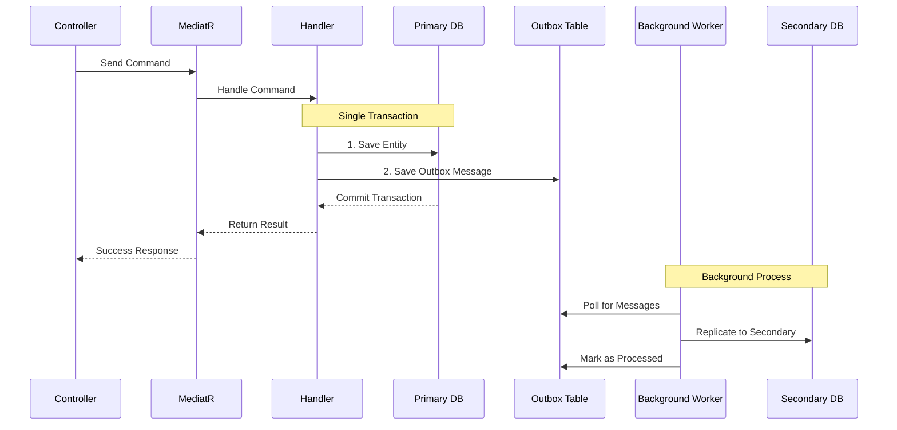
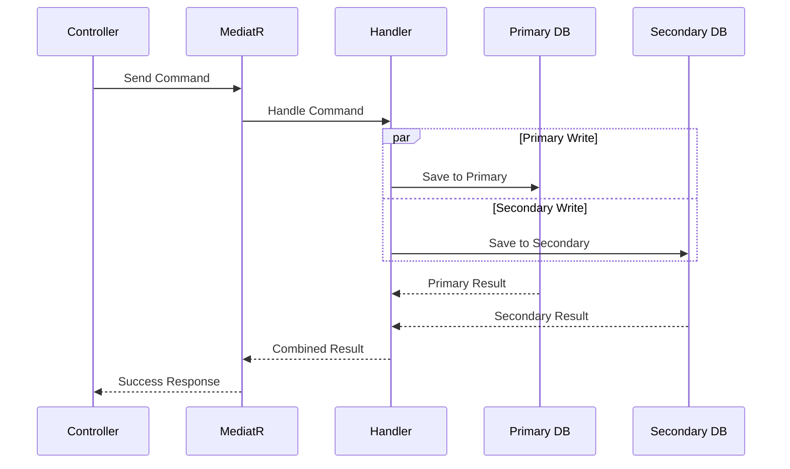

# AdminTool Data Flow Analysis & Dual Database Strategy

## 🔄 **Current Data Flow Architecture**

### **1. Request Flow (Current Implementation)**

```mermaid
graph TD
    A[HTTP Request] --> B[ScreenDefinitionController]
    B --> C[MediatR.Send()]
    C --> D[GetScreenDefinitionsQuery]
    D --> E[GetScreenDefinitionsHandler]
    E --> F[IUnitOfWork.ExecuteAsync()]
    F --> G[AdminDbContext]
    G --> H[Entity Framework Core]
    H --> I[Database Provider]
    I --> J[Oracle/InMemory Database]
    J --> K[Response Data]
    K --> L[ScreenDefnDto]
    L --> M[ApiResponse Wrapper]
    M --> N[HTTP Response]
```

### **2. Current Implementation Analysis**

Looking at your `ScreenDefinitionController.cs`:

```csharp
[Route("api/v1/admin/screen-pilot")]  // ← Route
public class ScreenDefinitionController : ControllerBase
{
    private readonly IMediator _mediator;  // ← MediatR dependency

    [HttpGet("screens")]
    public async Task<ActionResult<ApiResponse<IEnumerable<ScreenDefnDto>>>> GetScreens(
        [FromQuery] byte? status = null)
    {
        // Current flow: Controller → MediatR → Handler → UnitOfWork → DbContext
        var result = await _mediator.Send(new GetScreenDefinitionsQuery(status));
        
        return Ok(new ApiResponse<IEnumerable<ScreenDefnDto>>(
            result,
            new UserInfo("demo-user", "Demo User", "demo@example.com"),
            new AccessInfo(true, true, Array.Empty<string>(), "primary"),  // ← DB Route hint
            Guid.NewGuid().ToString(),
            DateTimeOffset.UtcNow
        ));
    }
}
```

## 🔀 **Dual Database Update Strategy**

### **Option 1: Transactional Outbox Pattern (Recommended)**



### **Option 2: Dual-Write Pattern (Immediate)**



## 🏗️ **Implementation: Enhanced Data Flow**

### **Step 1: Enhanced UnitOfWork for Dual DB**

```csharp
public interface IUnitOfWork
{
    // Current method
    Task<TResult> ExecuteAsync<TResult>(
        Func<IAdminDbContext, CancellationToken, Task<TResult>> operation, 
        CancellationToken cancellationToken = default);
    
    // New dual-write methods
    Task<TResult> ExecuteDualWriteAsync<TResult>(
        Func<IAdminDbContext, CancellationToken, Task<TResult>> operation,
        string dbRoute = "primary",
        CancellationToken cancellationToken = default);
        
    Task ExecuteWithOutboxAsync(
        Func<IAdminDbContext, CancellationToken, Task> operation,
        string targetRoute = "secondary",
        CancellationToken cancellationToken = default);
}
```

### **Step 2: Enhanced Handler with Dual Write**

```csharp
public class CreateScreenDefinitionHandler : IRequestHandler<CreateScreenDefinitionCommand, ScreenDefnDto>
{
    private readonly IUnitOfWork _unitOfWork;
    private readonly ILogger<CreateScreenDefinitionHandler> _logger;

    public async Task<ScreenDefnDto> Handle(CreateScreenDefinitionCommand request, CancellationToken cancellationToken)
    {
        // Primary database write with outbox
        return await _unitOfWork.ExecuteWithOutboxAsync(async (context, ct) =>
        {
            // 1. Create entity
            var entity = new ScreenDefinition
            {
                Code = request.ScreenCode,
                Name = request.ScreenName,
                Description = request.Description,
                Status = 1,
                CreatedAt = DateTimeOffset.UtcNow,
                CreatedBy = "current-user"
            };

            // 2. Save to primary database
            context.ScreenDefinitions.Add(entity);
            await context.SaveChangesAsync(ct);

            // 3. Create outbox message for secondary database
            var outboxMessage = new OutboxMessage
            {
                EntityType = "ScreenDefinition",
                EntityId = entity.Id,
                Operation = "CREATE",
                Data = JsonSerializer.Serialize(entity),
                TargetRoute = "secondary",
                CreatedAt = DateTimeOffset.UtcNow,
                Status = OutboxStatus.Pending
            };

            context.OutboxMessages.Add(outboxMessage);
            await context.SaveChangesAsync(ct);

            // 4. Return result
            return MapToDto(entity);
        }, cancellationToken);
    }
}
```

### **Step 3: Background Worker for Outbox Processing**

```csharp
public class OutboxProcessorService : BackgroundService
{
    private readonly IServiceProvider _serviceProvider;
    private readonly ILogger<OutboxProcessorService> _logger;

    protected override async Task ExecuteAsync(CancellationToken stoppingToken)
    {
        while (!stoppingToken.IsCancellationRequested)
        {
            try
            {
                await ProcessPendingMessages();
                await Task.Delay(TimeSpan.FromSeconds(10), stoppingToken); // Poll every 10 seconds
            }
            catch (Exception ex)
            {
                _logger.LogError(ex, "Error processing outbox messages");
            }
        }
    }

    private async Task ProcessPendingMessages()
    {
        using var scope = _serviceProvider.CreateScope();
        var unitOfWork = scope.ServiceProvider.GetRequiredService<IUnitOfWork>();

        // Get pending outbox messages
        var pendingMessages = await unitOfWork.ExecuteAsync(async (context, ct) =>
        {
            return await context.OutboxMessages
                .Where(m => m.Status == OutboxStatus.Pending)
                .OrderBy(m => m.CreatedAt)
                .Take(10) // Process in batches
                .ToListAsync(ct);
        });

        foreach (var message in pendingMessages)
        {
            await ProcessMessage(message, unitOfWork);
        }
    }

    private async Task ProcessMessage(OutboxMessage message, IUnitOfWork unitOfWork)
    {
        try
        {
            // Route to secondary database
            await unitOfWork.ExecuteAsync(async (context, ct) =>
            {
                switch (message.Operation)
                {
                    case "CREATE":
                        await HandleCreate(message, context);
                        break;
                    case "UPDATE":
                        await HandleUpdate(message, context);
                        break;
                    case "DELETE":
                        await HandleDelete(message, context);
                        break;
                }

                await context.SaveChangesAsync(ct);
            }, message.TargetRoute); // Use target route (secondary)

            // Mark as processed
            await MarkAsProcessed(message.Id, unitOfWork);
            
            _logger.LogInformation("Processed outbox message {MessageId} for {EntityType} {EntityId}", 
                message.Id, message.EntityType, message.EntityId);
        }
        catch (Exception ex)
        {
            await MarkAsFailed(message.Id, ex.Message, unitOfWork);
            _logger.LogError(ex, "Failed to process outbox message {MessageId}", message.Id);
        }
    }
}
```

## 📊 **Data Flow Comparison**

### **Current Flow (Single Database)**
```
HTTP Request
    ↓
ScreenDefinitionController
    ↓
MediatR.Send(GetScreenDefinitionsQuery)
    ↓
GetScreenDefinitionsHandler
    ↓
IUnitOfWork.ExecuteAsync()
    ↓
AdminDbContext (Primary/InMemory)
    ↓
Entity Framework Core
    ↓
Database Provider (Oracle/InMemory)
    ↓
Response (ScreenDefnDto wrapped in ApiResponse)
```

### **Enhanced Flow (Dual Database with Outbox)**
```
HTTP Request
    ↓
ScreenDefinitionController
    ↓
MediatR.Send(CreateScreenDefinitionCommand)
    ↓
CreateScreenDefinitionHandler
    ↓
IUnitOfWork.ExecuteWithOutboxAsync()
    ┌─────────────────────────────────────┐
    │  SINGLE TRANSACTION (Primary DB)    │
    │  1. Save ScreenDefinition           │
    │  2. Save OutboxMessage             │
    │  3. Commit Transaction             │
    └─────────────────────────────────────┘
    ↓
Response (Immediate - Primary DB saved)

Background Process (Async):
OutboxProcessorService
    ↓
Poll OutboxMessages (every 10s)
    ↓
IUnitOfWork.ExecuteAsync("secondary")
    ↓
AdminDbContext (Secondary DB)
    ↓
Replicate Entity to Secondary DB
    ↓
Mark OutboxMessage as Processed
```

## 🎯 **Key Benefits of This Approach**

### **1. Consistency Guarantees**
- ✅ **Primary DB + Outbox**: Single transaction ensures atomicity
- ✅ **No data loss**: Outbox messages persist even if secondary is down
- ✅ **Retry logic**: Failed messages can be retried automatically

### **2. Performance Benefits**
- ✅ **Fast response**: User gets immediate response after primary write
- ✅ **Non-blocking**: Secondary replication doesn't slow down user operations
- ✅ **Scalable**: Background processing can be scaled independently

### **3. Reliability Features**
- ✅ **Failure isolation**: Secondary DB issues don't affect primary operations
- ✅ **Monitoring**: Outbox table provides audit trail and monitoring
- ✅ **Recovery**: Can replay failed messages or rebuild secondary from primary

## 🔧 **Configuration Example**

```csharp
// appsettings.json
{
  "DatabaseSettings": {
    "Primary": {
      "ConnectionString": "...",
      "Provider": "Oracle"
    },
    "Secondary": {
      "ConnectionString": "...",
      "Provider": "Oracle"  
    },
    "OutboxProcessing": {
      "Enabled": true,
      "PollingIntervalSeconds": 10,
      "BatchSize": 10,
      "MaxRetries": 3
    }
  }
}
```

This dual database strategy ensures **data consistency** while maintaining **high performance** and **reliability** for your admin operations across both primary and secondary databases.

Would you like me to implement any of these components in your current codebase?